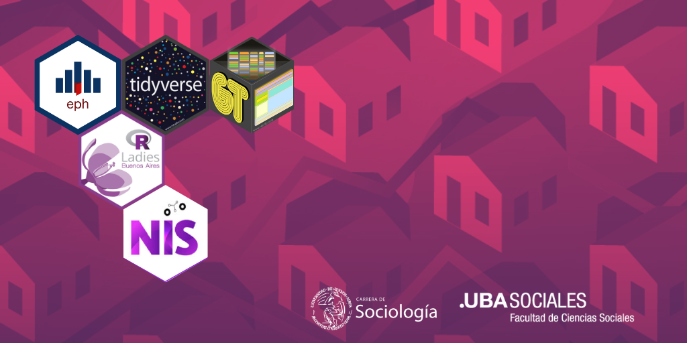

# Taller Introducción al Análisis de la Encuesta Permanente de Hogares (EPH) con R
### Armado por Betsy Cohen & Andrea Gómez Vargas

Taller organizado por [R-Ladies Buenos Aires](https://rladiesba.netlify.app/) & el [Núcleo de Innovaciòn Social](https://www.nucleodeinnovacion.com/) para del ciclo de formaciòn complementaria de la carrera de Sociologìa de la Facultad de Ciencias Sociales de la UBA. 

En esta ocasión vamos a presentar la potencia de la EPH y {tidyverse} y a mostrarles cómo podemos obtener información directamente con el paquete {eph} y traducirla en indicadores para el análisis de ciencias sociales.

# Licencia 

Este taller está a disposición del público bajo licencias de código abierto. Toda la documentación y los materiales publicados en este repositorio están disponibles bajo una licencia **CC BY-SA-NC**.

A continuación, puedes leer más sobre la [licencia de Creative Commons Reconocimiento-NoComercial-CompartirIgual 4.0 Internacional](https://creativecommons.org/licenses/by-nc-sa/4.0/).

